# Pipeline architecture — poonsuk-api + hotel_booking (Lab 10)

One repository (`PeeranatPathomkul/Lab_jenkins_repo`), two Jenkinsfiles, two multibranch jobs. A GitHub push reaches Jenkins through the ngrok webhook; each job decides from the changed paths whether it has work to do. Every stage that does work runs in a throwaway pod in the kind cluster (`cloud 'kind'`, namespace `jenkins-agents`, templates in `ci/k8s/`). ⛔ = gate that stops the pipeline.

```mermaid
flowchart TB
    dev([git push / pull request]) --> gh[GitHub] -->|webhook via ngrok| jenkins{{Jenkins controller}}
    jenkins --> api_job[taskflow-multibranch<br/>Jenkinsfile]
    jenkins --> mob_job[taskflow-mobile<br/>frontend/Jenkinsfile]

    subgraph API["API pipeline — poonsuk-api (NestJS)"]
        direction TB
        s1["⛔ Secrets Detection<br/>gitleaks, full history · pod gitleaks"]
        f1{"changes outside frontend/?<br/>or Build Now / first build"}
        subgraph CHECKS["Checks — one pod (ci/k8s/checks.yaml)"]
            direction TB
            subgraph VERIFY["Verify — parallel, failFast"]
                v1["⛔ Lint & Unit Test<br/>npm ci → ESLint → SAST ESLint → Jest + coverage"]
                v2["SAST — Semgrep (report)"]
                v3["⛔ SCA — npm audit<br/>critical = fail · high = warn"]
                v4["⛔ SBOM<br/>Syft CycloneDX + Cosign sign/verify"]
                v5["⛔ Terraform Validate"]
                v6["⛔ Ansible Lint"]
                v7["⛔ IaC Security Scan<br/>tfsec + checkov"]
            end
            subgraph GATES["Gates — parallel, failFast"]
                g1["⛔ Policy Gate<br/>OPA policy/security.rego"]
                g2["SonarQube Analysis → ⛔ Quality Gate<br/>coverage ≥ 70 %"]
            end
            VERIFY --> GATES
        end
        b1["Build Image — Kaniko<br/>registry:5000/poonsuk-api:&lt;sha7&gt;, immutable"]
        subgraph IMG["Image checks — parallel, failFast"]
            i1["⛔ Container Scan<br/>Trivy HIGH/CRITICAL"]
            i2["⛔ E2E — Playwright<br/>pod: Postgres + Redis + API image"]
        end
        t1["Terraform Plan<br/>LocalStack S3 state · non-PR"]
        t2["⛔ Approval (human)<br/>only APPLY_INFRA"]
        t3["Terraform Apply → Configure with Ansible"]
        d1["⛔ Blue/Green Deploy (kind)<br/>idle colour → smoke test → switch<br/>failure ⇒ automatic rollback"]
        d2["Deploy — Staging<br/>develop only"]
        h1["⛔ Pipeline Health Gate<br/>main only · Prometheus success rate ≥ 90 %<br/>over ≥ 20 recent builds, fails closed"]
        d3["⛔ Deploy — Production<br/>main only · input, submitter admin"]
        s1 --> f1 -->|yes| CHECKS --> b1 --> IMG --> t1 --> t2 --> t3 --> d1 --> d2 --> h1 --> d3
    end

    subgraph MOB["Mobile pipeline — hotel_booking (Flutter) · one pod (ci/k8s/flutter.yaml)"]
        direction TB
        m0{"changes in frontend/?<br/>or Build Now / first build"}
        m1["Setup — flutter pub get --enforce-lockfile"]
        subgraph MV["Verify — parallel, failFast"]
            m2["⛔ flutter analyze"]
            m3["⛔ flutter test --coverage"]
            m4["⛔ SCA — osv-scanner<br/>pubspec.lock"]
        end
        m5["⛔ Build — Debug APK (arm64)<br/>every branch"]
        m6["⛔ Build — Release AAB<br/>main only · signed with Jenkins-stored upload key<br/>jarsigner + certificate check"]
        m0 -->|yes| m1 --> MV --> m5 --> m6
    end

    api_job --> s1
    mob_job --> m0
    d3 --> mail[/"e-mail on success / failure<br/>branch + build URL (Mailpit)"/]
    m6 --> mail
    prom[(Prometheus<br/>scrapes /prometheus/)] -.-> h1
    jenkins -.->|metrics| prom
```

| Where it runs | What |
|---|---|
| kind cluster `taskflow` (pods, deleted after each stage) | every build, test, scan and deploy stage |
| Jenkins controller (no pod) | Quality Gate wait, Approval, production input, Staging/Production log lines, e-mail |
| Lab services (Docker network `kind`) | `registry:5000`, `sonarqube:9000`, `localstack:4566`, `prometheus:9090`, `docker-proxy:2375` (Docker API for Terraform), `mailpit:1025` |
| Secrets | Jenkins credentials only: `cosign-key`, `cosign-password`, `sonar-token`, `localstack-aws`, `ansible-ssh`, `kubeconfig-kind`, `android-keystore`, `android-keystore-password`, `github-token` |

Rollback of a failed production deploy: [rollback-runbook.md](rollback-runbook.md).
